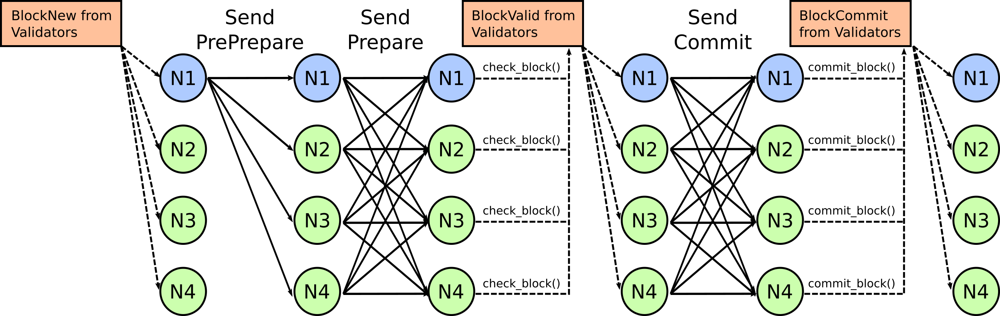
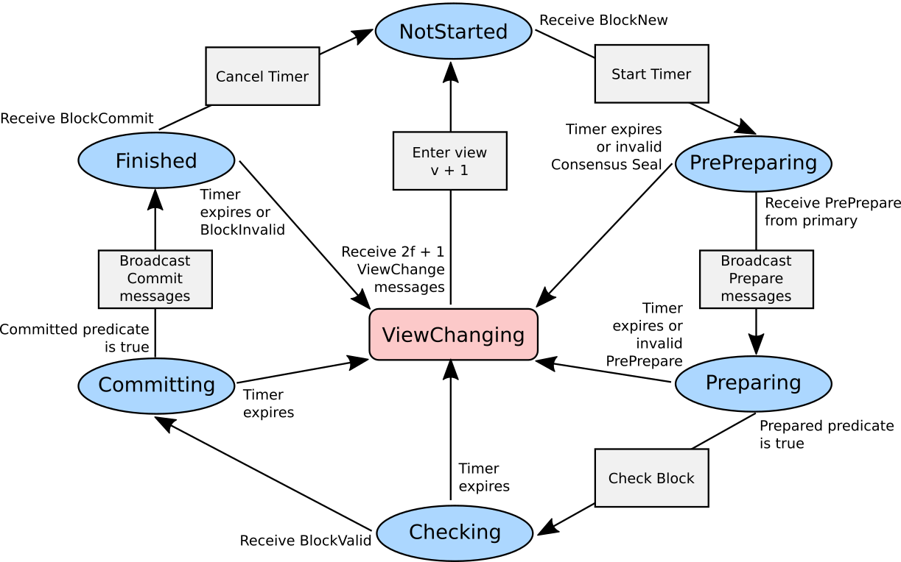

Architecture
************

The Sawtooth PBFT algorithm is a voting-based consensus algorithm with Byzantine
fault tolerance, which ensures `safety and liveness
<https://en.wikipedia.org/wiki/Liveness#Liveness_and_safety>`__.
The network can tolerate a certain number of "bad" nodes. As long as this number
is not exceeded, the network will work properly. In addition, blocks committed
by nodes are final, so there are no forks in the network.

The nodes on the network send many messages to reach consensus, commit blocks,
and maintain a healthy leader node, called a `primary node`. The network
switches to a new primary (called a `view change`) at regular intervals, as well
as when the current primary is faulty.

* The primary node builds and publishes blocks.

* The other nodes (called `secondary nodes`) vote on blocks and the health of
  the leader.

Sawtooth PBFT runs on each node in the network as a `consensus engine`, a
separate process that handles consensus-related functionality and communicates
with the validator through the consensus API.

The following sections describe Sawtooth PBFT architecture:

* :ref:`Network overview <network-overview-label>`: Describes PBFT fault
  tolerance, view changes, sequence numbers, and the information stored
  by each node

* :ref:`Consensus messages <consensus-messages-label>`: Explains consensus
  message structures and message types

* :ref:`Sawtooth PBFT operation <pbft-operation-label>`: Shows how the
  algorithm handles initialization, normal mode (block processing), and view
  changes

.. _network-overview-label:

Network Overview
================

Fault Tolerance
---------------

A PBFT network consists of nodes that are ordered from 0 to `n-1`, where
`n` is the total number of nodes in the network. The
:doc:`on-chain setting <on-chain-settings>` ``sawtooth.consensus.pbft.peers``
lists all nodes and determines the node order.

The PBFT algorithm guarantees network `safety
<https://en.wikipedia.org/wiki/Liveness#Liveness_and_safety>`__
as long as the number of faulty nodes remains below the required percentage.
The maximum number of faulty nodes that the network can tolerate is determined
by the formula :math:`f = \frac{n - 1}{3}`. In other words, no more than one
third of the nodes (rounded down) can be unreachable or dishonest at any given
time.

For example, a four-node network can tolerate one faulty node. (PBFT requires a
minimum of four nodes in order to maintain Byzantine fault tolerance.)
Increasing the size of the network reduces the likelihood that all
:math:`\frac{n - 1}{3}` nodes would be faulty at the same time.

.. _view-changes-choosing-primary-label:

View Changes: Choosing a New Primary
------------------------------------

A `view` is the period of time that a given node is the primary, so a `view
change` means switching to a different primary node. The next primary is
selected in a round-robin (circular) fashion, according to the order of nodes
listed in the :doc:`on-chain setting <on-chain-settings>`
``sawtooth.consensus.pbft.peers``.

In a four-node network, for example, the first node (node 0) is the primary at
view 0, the second node (node 1) is the primary at view 1, and so on.  When the
network gets to view 4, it will return to node 0 as the primary.

The algorithm uses the formula `p = v mod n` to determine the next
primary. In this formula, `p` is the primary, `v` is the view number, and `n` is
the total number of nodes in the network. For example, if a four-node network is
at view 7, the formula `7 mod 4` determines that node 3 is the primary.

The Sawtooth PBFT algorithm changes the primary at regular intervals, as well as
when the secondary nodes determine that the current primary is faulty.
See :ref:`view-changing-mode-label` for a description of this process.

Sequence Numbers
----------------

In addition to moving through a series of views, the network moves through a
series of `sequence numbers`. In Sawtooth PBFT, a node's sequence number is
the same as the block number of the next block in the chain. For example, a node
that is on sequence number 10 has already committed block 9 and is evaluating
block 10.

Also, each message includes a sequence number that indicates which block the
message is for. For example, a message with sequence number 10 applies to block
number 10.

.. _node-storage-label:

Information Storage
-------------------

Each node stores several key pieces of information as part of its state:

* List of nodes in the network (also called "connected peers")

* Current view number, which identifies the primary node

* Current sequence number, which is also the number of the block being processed

* If in normal mode, the step of the algorithm it’s on
  (see :ref:`normal-mode-label`)

* Log of all blocks it has received

* Log of all messages it has received

.. _network-config-label:

Network Configuration
---------------------

Sawtooth PBFT configures the network with on-chain settings, which are processed
by the `Settings transaction processor
<https://sawtooth.hyperledger.org/docs/core/releases/latest/transaction_family_specifications/settings_transaction_family.html>`__ (or an equivalent).

These settings list each node in the network, set the view-change period (how
often the primary changes), and specify other items such as the block publishing
frequency, timeout periods, and message log size.
For more information, see :doc:`on-chain-settings`.

.. _consensus-messages-label:

Consensus Messages
==================

When a node receives a new consensus message from a peer, it checks the message
type and creates the appropriate language-specific object for that type. All
PBFT consensus messages are serialized as `protobufs (protocol buffers)
<https://developers.google.com/protocol-buffers/>`__.

Generally, the message object must be verified to make sure that everything is
legitimate. The PBFT algorithm handles consensus-related verification, such as
making sure that messages match and that there are the correct number of
messages.  The Sawtooth validator verifies the non-consensus parts of a message,
such as ensuring that the message has a valid signature.

Message Definitions
-------------------

Most Sawtooth PBFT messages use the ``PbftMessage`` message format, as shown
below. An auxiliary ``PbftViewChange`` format is used to request a view change
when a node suspects that the primary is faulty or unresponsive.

Sawtooth PBFT also uses some of the message types defined in the consensus API,
such as ``BlockNew`` and ``BlockCommit`` (as well as the system ``Shutdown``
message). These messages are called "updates" to distinguish them from the
consensus messages.

.. code-block:: protobuf

   // PBFT-specific block information (don't need to keep sending the whole payload
   // around the network)
   message PbftBlock {
     bytes block_id = 1;

     bytes signer_id = 2;

     uint64 block_num = 3;

     bytes summary = 4;
   }

   // Represents all common information used in a PBFT message
   message PbftMessageInfo {
     // Type of the message
     string msg_type = 1;

     // View number
     uint64 view = 2;

     // Sequence number (helps with ordering the log)
     uint64 seq_num = 3;

     // Node who signed the message
     bytes signer_id = 4;
   }

   // A generic PBFT message (PrePrepare, Prepare, Commit)
   message PbftMessage {
     // Message information
     PbftMessageInfo info = 1;

     // The actual message
     PbftBlock block = 2;
   }

   // View change message, for when a node suspects the primary node is faulty
   message PbftViewChange {
     // Message information
     PbftMessageInfo info = 1;
   }

Message Types
-------------

A Sawtooth PBFT message has one of the following types:

* ``PrePrepare``: Sent by the primary node when it has received a new block from
  the validator (as a ``BlockNew`` update).

* ``Prepare``: Broadcast from every node after a ``PrePrepare`` has been received
  for the current working block. This message is used to verify the ``PrePrepare``
  message and to signify that the block is ready to be checked.

* ``Commit``: Broadcast from every node after a ``BlockValid`` update has been
  received for the current working block. This message is used to determine if
  there is consensus for committing the current working block.

* ``ViewChange``: Sent by any node that suspects that the primary node is
  faulty. Sufficient ``ViewChange`` messages will trigger a view change.

.. _pbft-operation-label:

PBFT Operation
==============

The Sawtooth PBFT algorithm starts with initialization, then operates in one of
two modes:

* :ref:`Normal mode <normal-mode-label>` for processing blocks

* :ref:`View Changing mode <view-changing-mode-label>` for switching to a
  different primary node

.. note::

   The original PBFT algorithm also defines a Checkpointing (garbage collection)
   mode to prune log messages after a certain number of blocks have been
   committed. Sawtooth PBFT does not implement checkpointing. Instead, it uses
   the on-chain setting ``sawtooth.consensus.pbft.max_log_size`` to trigger
   log pruning on each node.

Initialization
--------------

When the Sawtooth PBFT consensus engine starts, it does the following:

* Sets the initial sequence number in state to 0

* Sets the initial view in state to 0

* Creates the message log, with all fields empty

* Establishes timers and counters for block durations and view changes,
  based on the on-chain settings

.. prepared-committed-conditions-label:

Node Conditions (``Prepared`` and ``Committed``)
------------------------------------------------

.. note::

   This section uses the following terms:

   * ``Prepared`` means a node is ready to start Normal mode. ``Prepared`` is
     true for the current node if the following messages are present in its
     log:

       - The original ``BlockNew`` message
       - A ``PrePrepare`` message that matches the original message (in the
         current view)
       - :math:`2f + 1` matching ``Prepare`` messages from different nodes that
         match the ``PrePrepare`` message (including its own)

   * ``Committed`` means that a node considers the current block ready to be
     committed. Specifically, ``committed`` is true for the current node if:

     - This node is ``Prepared``
     - The node has accepted :math:`2f + 1` ``Commit`` messages, including its own

.. _normal-mode-label:

Normal Mode
-----------

In Normal mode, nodes check blocks and approve them to be committed to the
blockchain. The Sawtooth PBFT algorithm usually operates in normal mode unless a
:ref:`view change <view-changing-mode-label>` is necessary.

Normal mode includes the following steps:

1. The nodes receive a ``BlockNew`` message from the consensus API, which
   represents several batched client requests.

   - The primary node checks that the message is legitimate by looking at the
     ``signer_id`` of the block in the ``BlockNew`` message and making sure it
     is the next block in the chain. Next, the primary assigns a sequence number
     to the message and broadcasts a ``PrePrepare`` message to all nodes.

   - If the message is legitimate, all nodes tentatively update their working
     blocks. The secondary nodes also start a commit timer, in case the primary
     doesn't finish committing this block.

#. All nodes receive and validate ``PrePrepare`` messages. This message is
   valid if:

    - The ``signer_id`` and ``summary`` of block inside ``PrePrepare`` match the
      corresponding fields of the original ``BlockNew`` block
    - The view in ``PrePrepare`` message corresponds to this node’s current view
    - This message hasn’t already been accepted with a different ``summary``

   If the ``PrePrepare`` is invalid, the node starts a view change.

#. Once the ``PrePrepare`` message is determined to be valid, the primary and
   secondary nodes perform different operations:

    - The primary ensures that the message matches the ``BlockNew`` update, then
      broadcasts a ``Prepare`` message.
    - Each secondary node updates its own sequence number from the message's
      sequence number, then broadcasts a ``Prepare`` message.

#. Each node receives ``Prepare`` messages and checks them all against their
   associated ``PrePrepare`` message in the node’s message log.

#. Once a node is :ref:`prepared <prepared-committed-conditions-label>`, it
   calls ``check_blocks()`` on the current working block and waits for a
   response from the validator.

   - If the node receives a ``BlockValid`` update, it broadcasts a ``Commit``
     message to all other nodes.

    - If the response is a ``BlockInvalid`` update, the node proposes a view
      change.

#. When a node is :ref:`committed <prepared-committed-conditions-label>`,
   it calls ``commit_block()`` to approve the block to be committed and advances
   the chain head.

#. When a node receives a ``BlockCommit`` update, the action depends on whether
   it's a primary or secondary node:

   - The primary node calls ``initialize_block()``
   - A secondary node stops its commit timer

#. If ``block_duration`` has elapsed, the primary tries to call
   ``summarize_block()`` with the current working block. If the working block is
   not ready (``BlockNotReady`` or ``InvalidState`` occurs), nothing happens.
   Otherwise, it calls ``finalize_block()``. This, in turn, sends out a
   ``BlockNew`` update to the network, which starts the next cycle of Normal
   mode.

This diagram shows the messages sent during Normal mode and the interactions
with the validators. N1 is the primary node; N2, N3, and N4 are secondary nodes.

.. _view-changing-mode-label:

View Changing Mode
------------------

A `view change` switches to a different primary node. A view change can be
trigged if the primary node is unresponsive, as determined by its failure to
commit the current working block within a specified amount of time.

When a secondary node receives a ``BlockNew`` message, it starts a commit timer.
If that node receives a ``Commit`` message before the time expires, it cancels
the timer and proceeds as normal. If the timer expires, it considers the primary
node to be faulty and requests a view change by sending a ``ViewChange``
message.  However, view changing mode does not occur until enough other nodes
agree (send their own ``ViewChange`` messages).

View changing mode has the following steps:

1. Any node who decides the primary is faulty sends a ``ViewChange`` message to
   all nodes. This message contains the node’s current sequence number (block
   number) and  its current view.

#. After sending the ``ViewChange`` message, the node enters View Changing mode.

#. Once a node receives :math:`2f + 1` ``ViewChange`` messages (including
   its own), it changes its own view to :math:`v + 1`, and resumes Normal
   operation.

The next primary node is determined by the node ID, in sequential order, based
on the order of nodes in the ``sawtooth.consensus.pbft.peers`` on-chain setting.
For more information, see :ref:`view-changes-choosing-primary-label`.

.. _algorithm-phases-label:

Summary: Algorithm Phases
-------------------------

The Sawtooth PBFT algorithm follows a state-machine replication pattern that
defines the necessary phases, transitions, and actions for the algorithm.
In the following diagram, the ring of blue ovals shows the phases in
Normal mode, and the gray boxes represent the algorithm's actions.

   :caption:
   Phases and transitions for Sawtooth PBFT

The PBFT phases are:

* ``NotStarted``: No blocks are being processed and no new ``BlockNew`` updates
  have been received. The node is ready to receive a ``BlockNew`` update for
  the next block.

* ``PrePreparing``: A ``BlockNew`` update has been received through the
  consensus API. The node is ready to receive a ``PrePrepare`` message for the
  block corresponding to the ``BlockNew`` update.

* ``Preparing``: A ``PrePrepare`` message has been received and is valid.
  The node is ready to receive ``Prepare`` messages that correspond to this
  ``PrePrepare`` message.

* ``Checking``: The node is
  :ref:`prepared <prepared-committed-conditions-label>`, which means that it
  has a ``BlockNew`` message, a ``PrePrepare`` message, and :math:`2f + 1`
  corresponding ``Prepare`` messages. The node is ready to receive a
  ``BlockValid`` update.

* ``Committing``: A ``BlockValid`` has been received. The node is ready to
  receive ``Commit`` messages.

* ``Finished``: :ref:`Committed <prepared-committed-conditions-label>` is true
  and the block has been committed to the chain. The node is ready to receive a
  ``BlockCommit`` update.

.. note::

   Any phase can be interrupted if the commit timeout expires, which forces the
   node into :ref:`View Changing mode <view-changing-mode-label>`.

Sawtooth PBFT defines the following transitions between the algorithm's phases:

- ``NotStarted`` → ``PrePreparing``: Caused by receiving a ``BlockNew`` update
  for the next block.

- ``PrePreparing`` → ``Preparing``: Caused by receiving a ``PrePrepare`` message
  corresponding to the ``BlockNew`` update.

- ``Preparing`` → ``Checking``: Caused when the node is
  ":ref:`prepared <prepared-committed-conditions-label>`".

- ``Checking`` → ``Committing``: Caused by receiving a ``BlockValid`` update
  corresponding to the current working block.

- ``Committing`` → ``Finished``: Caused when the node is
  ":ref:`committed <prepared-committed-conditions-label>`".

- ``Finished`` → ``NotStarted``: Caused by receiving a ``BlockCommit`` update
  for the current working block.

.. Licensed under Creative Commons Attribution 4.0 International License
.. https://creativecommons.org/licenses/by/4.0/
